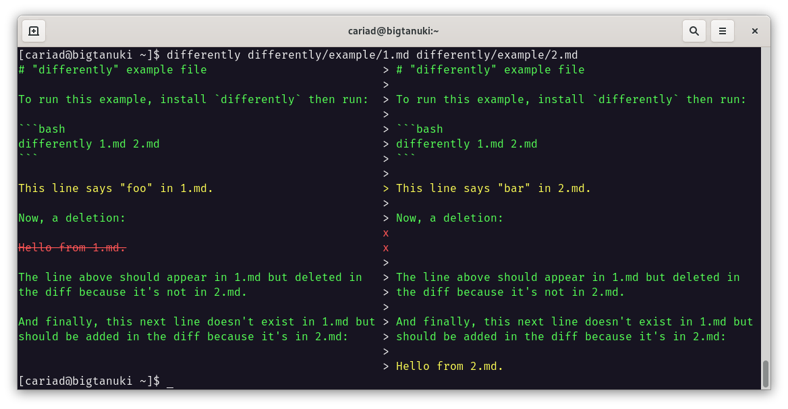

# differently

[](https://codecov.io/gh/cariad/differently) [](https://circleci.com/gh/cariad/differently/tree/main)

`differently` is a CLI tool and Python package for visualising the differences between objects.



```bash
python -m differently examples/1.json examples/2.yml --in-format json,yaml --out-format json
```

<!--dinject as=markdown host=shell range=start-->

```text
{                                          =  {
  "array_of_dictionaries": [               =    "array_of_dictionaries": [
    {                                      =      {
      "name": "Bobby Pringles",            ~        "name": "Bobby Salami",
      "occupation": "Fire Starter"         ~        "occupation": "Fire Fighter"
    },                                     =      },
    {                                      =      {
      "name": "Susan Cheddar",             =        "name": "Susan Cheddar",
      "occupation": "Transporter Chief"    =        "occupation": "Transporter Chief"
    },                                     =      },
    {                                      =      {
      "name": "Jade Rat",                  =        "name": "Jade Rat",
      "occupation": "Lightning Conductor"  ~        "occupation": "Lightning Chaser"
    }                                      =      }
  ],                                       =    ],
  "array_of_strings": [                    =    "array_of_strings": [
    "This is the first line.",             =      "This is the first line.",
    "This is the second line.",            =      "This is the second line.",
                                           >      "This is the second-point-five line.",
    "This is the third line."              =      "This is the third line."
  ],                                       =    ],
  "dictionary": {                          =    "dictionary": {
                                           >      "flavour": "Cheese and Onion",
    "greeting": "Hello",                   =      "greeting": "Hello",
    "sound": "Fire Truck",                 x
    "username": "operator"                 ~      "username": "root"
  }                                        =    }
}                                          =  }
```

<!--dinject range=end-->

## Installation

```bash
pip install differently
```

## Command line usage

On the command line, run `differently` with the two files to compare:

```bash
differently file1 file2
```

## Python usage

To compare two strings, create a `TextDifferently` instance:

```python
from differently import TextDifferently

print(TextDifferently("foo", "bar"))
```

To compare two lists, create a `ListDifferently` instance:

```python
from differently import TextDifferently

print(ListDifferently(["foo"], ["bar"]))
```

## 👋 Hello!

**Hello!** I'm [Cariad Eccleston](https://cariad.io) and I'm an independent/freelance software engineer. If my work has value to you, please consider [sponsoring](https://github.com/sponsors/cariad/).

If you ever raise a bug, request a feature or ask a question then mention that you're a sponsor and I'll respond as a priority. Thank you!
