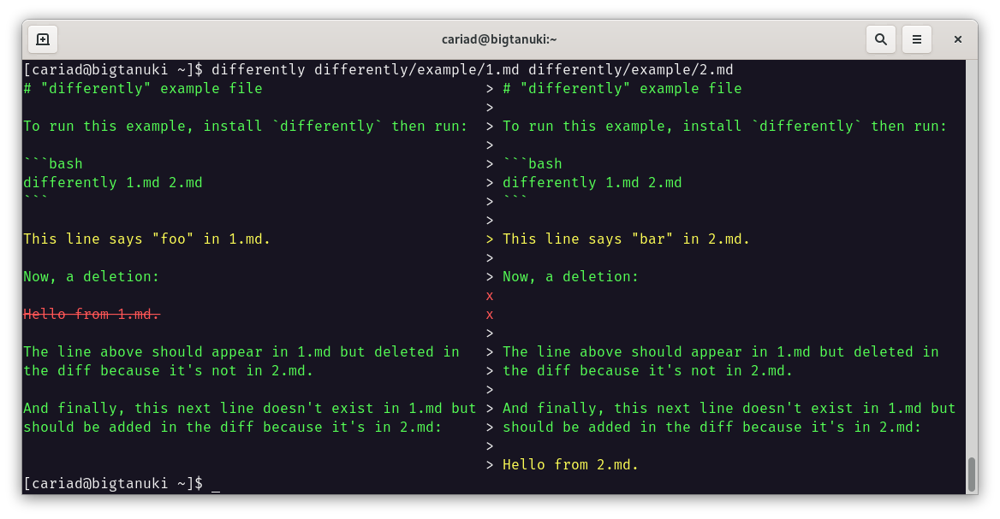

# differently

## Introduction

`differently` is a CLI tool and Python package for visualising the differences between things.



## Installation

`differently` requires **Python 3.8 or later**.

```bash
pip install differently
```

## Usage

### Command line

On the command line, run `differently` with the two files to compare:

```bash
bash file1 file2
```

### Python

To compare two strings, create a `TextDifferently` instance:

```python
from differently import TextDifferently

print(TextDifferently("foo", "bar"))
```

To compare two lists, create a `ListDifferently` instance:

```python
from differently import TextDifferently

print(ListDifferently(["foo"], ["bar"]))
```

`print()`-ing either of these class instances will print the differences in a coloured table.
