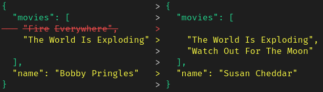

# Classes

## JsonDifferently

`JsonDifferently` visualises the differences between dictionaries as JSON.

```python
from differently import JsonDifferently
from typing import List, TypedDict

class PersonDict(TypedDict):
    name: str
    movies: List[str]

a: PersonDict = {
  "name": "Bobby Pringles",
  "movies": ["Fire Everywhere", "The World Is Exploding"],
}

b: PersonDict = {
  "name": "Susan Cheddar",
  "movies": ["The World Is Exploding", "Watch Out For The Moon"],
}

print(JsonDifferently(a, b))
```



The keys of the dictionaries are sorted in an attempt to compare like-for-like.
